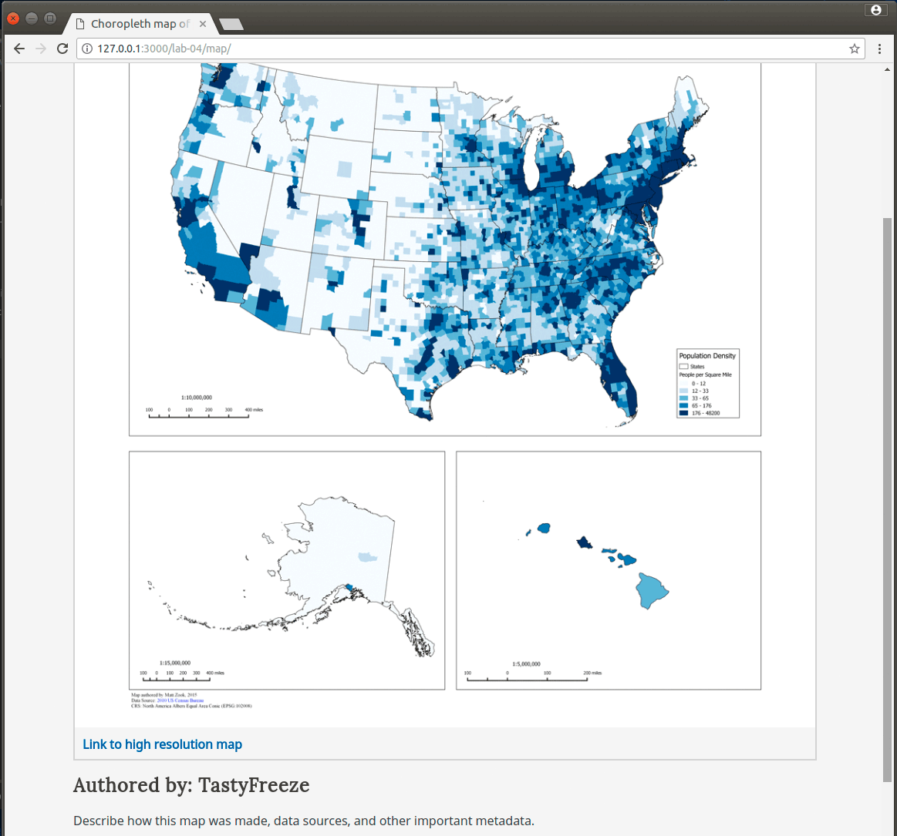
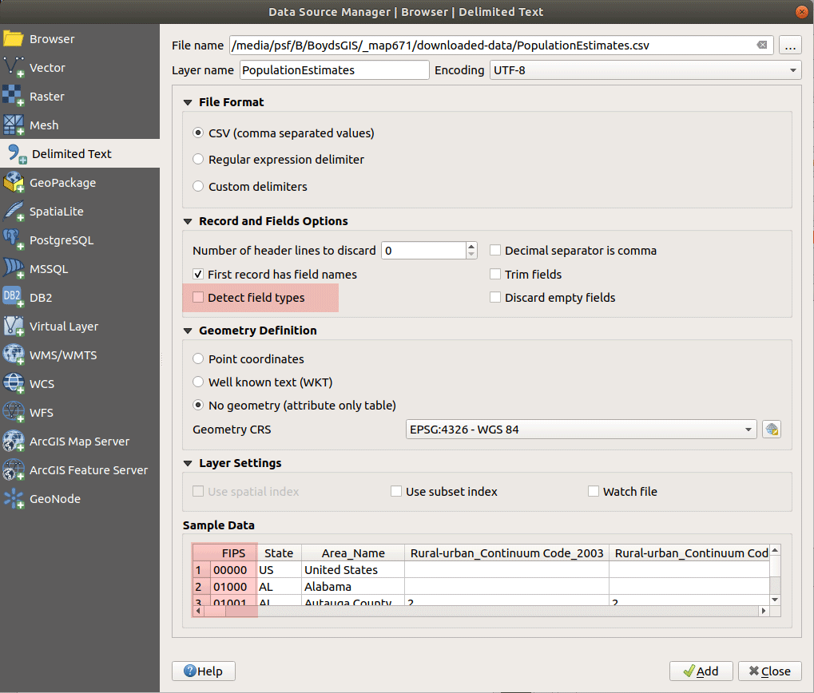
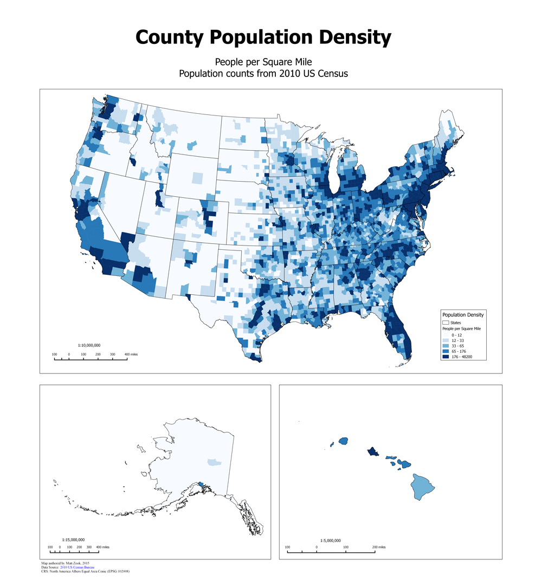
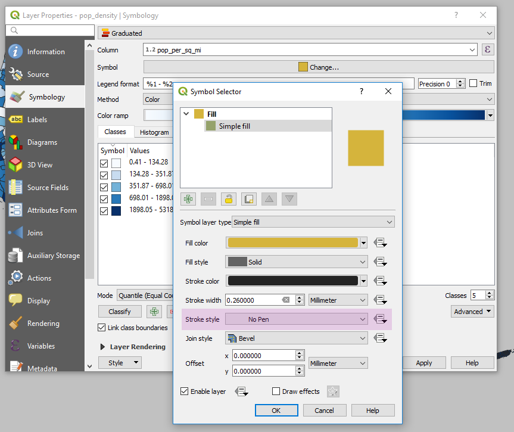
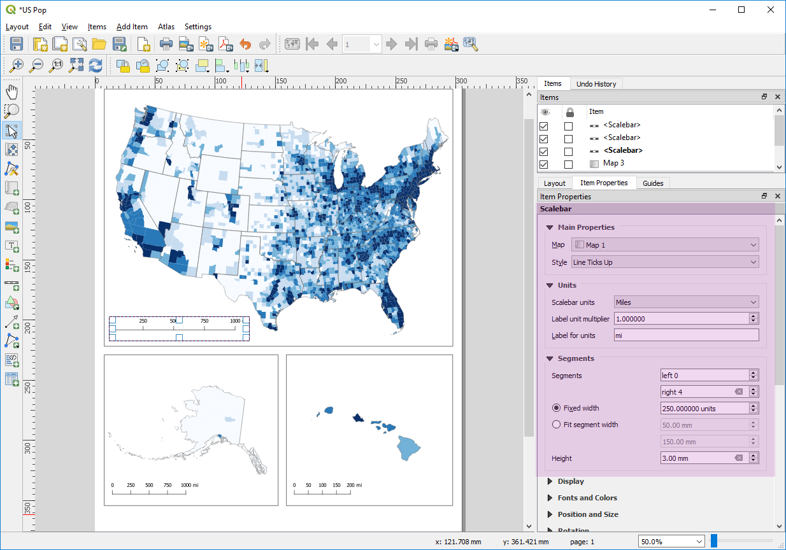

# Module 04 Lab Assignment

## Table of Contents

<!-- TOC -->

- [Module 04 Lab Assignment](#module-04-lab-assignment)
    - [Table of Contents](#table-of-contents)
    - [Create a map showing county population density (10 pts)](#create-a-map-showing-county-population-density-10-pts)
        - [Data files](#data-files)
        - [Required specifications of the deliverable](#required-specifications-of-the-deliverable)
        - [Challenge (+1 pt)](#challenge-1-pt)
        - [Submission](#submission)
    - [Example](#example)
    - [Suggestions and Tips](#suggestions-and-tips)

<!-- /TOC -->

The requirements of the map are listed below. All the tasks required to fulfill this assignment are documented within this and previous modules.

## Create a map showing county population density (10 pts)

You've been contracted to make a map of U.S. county population density for SAGA, the Saginaw Area GIS Authority. They are requesting a poster-sized map for the entire country and county data for Michigan. They need to have the map and GeoJSON published online in a web page.

### Data files

The following data files can be downloaded online. Place them in your *downloaded-data* (or in a folder outside of your repo):

* [cb_2017_us_county_500k.zip](https://www2.census.gov/geo/tiger/GENZ2017/shp/cb_2017_us_county_500k.zip) (Shapefile) 
* [cb_2017_us_state_500k.zip](https://www2.census.gov/geo/tiger/GENZ2017/shp/cb_2017_us_state_500k.zip) (Shapefile)
    * Source: [U.S. Census Bureau TIGER Products](https://www.census.gov/geographies/mapping-files/time-series/geo/carto-boundary-file.html)
* USA County population estimates from the [USDA Economic Research Service](https://www.ers.usda.gov/data-products/county-level-data-sets/download-data/)

### Required specifications of the deliverable

1) The final map must fulfill the following requirements:
>* The map must display counties in all 50 states (hint: add three maps to your Print Composer layout OR three separate maps on a web page).
>* The layout should be neatly organized.
>* Counties must be symbolized by population density in people per square mile using a 5-class quantile classification.
>* Use the coordinate reference system North America Equal Area (EPSG: 102008).

2) The client has also requested a copy of Michigan's County population density in GeoJSON format. The GeoJSON must fulfill the following requirement:

>* Coordinate Reference System must be WGS84 (EPSG: 4326).
>* Only two fields are required, the county name and population density in persons per square mile.
>* Must be a polygon layer with a precision of 4, i.e., to four decimal places.
>* Add the file to the *lab-04/map/geojson* folder.

3) The client has requested a web page that shows the static map(s) with a link to a higher resolution version. This web page map must meet the following requirements:

>* Map needs to be in two resolutions: 1) width of 1,200 px and 2) width of 8,000 px
>* Map image format should be a PNG.
>* Links must be available to access the higher resolution PNG and the GeoJSON.
>* The web page must have a meaningful title (both in the title and in the h1 elements) and metadata about the author, data source, and coordinate system.
>* Contact information in the footer must be tuned to you, the author.
>* The map page must be called "index.html" in the repo folder *lab-04/map*.

### Challenge (+1 pt)

The client has requested a single SQL file that demonstrates how to perform the join and density calculation. Place file the with the ".sql" file extension in the  _newmapsplus/map671-module-04-username/lab-04/map_ folder. (1 extra point!)

### Submission

Commit often, and when complete, push this repo to your remote. Paste URL link within the Canvas for this repo, *https://github.com/newmapsplus/map671-module-04-username*.

## Example

    
*Example web page with map*

## Suggestions and Tips

1) When you import the *PopulationEstimates.csv* from the United States Department of Agriculture, Economic Research Service website, disable **Detect field types** to allow the FIPS code to be imported with leading zeros. By default, QGIS will detect the field as numeric and strip the leading zeros. All fields will be encoded as *strings*, so you will need to convert population fields to numeric type to complete density calculation.

2) In Print Composer, start with a larger page size since it will be easier to symbolize the county polygons. The final map could look like this, but you are welcome to add your creative flair. 

3) When doing the join between the population estimates and county polygons, the fields _geoid_ and _fips_ are the alphanumeric values that uniquely identify counties.

4) You have a few choices for calculating the population per square mile. You can edit the table in QGIS with the **Field Calculator**, but be aware that you should create new fields before you make a table join, or **Export > Save Features as...** to a new layer after you make a table join. Lastly, if you investigate your Census Bureau layer attributes, you might find an interesting alternative!

5) Showing county polygon outlines might distract from interpreting population density. After you classify and symbolize population density, remove polygon outlines in the **Simple Fill** options.

6) After adding multiple maps to a Print Layout, you should assign scale bars to each map in the **Item Properties > Scalebar > Main Properties** option. Also, note how the **Scale bar units** should be in "Feet" and **Label units** in "Miles". You might need to apply rotation to your Alaska and Hawaii maps to look better formatted on the page.

7) When you are ready to create the GeoJSON layer for Michigan, you can remove fields under the option for **Select fields to export...**.
